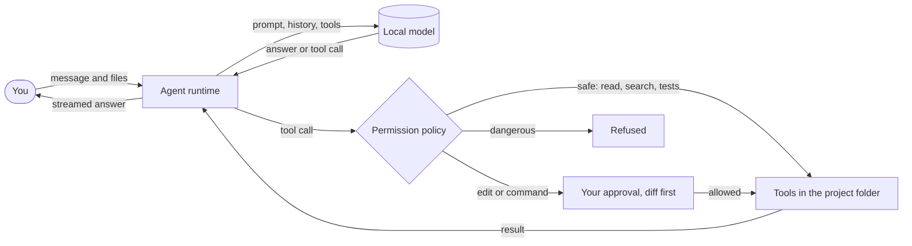

<div align="center">

# LocalOSXAi

**A native macOS coding agent for the models on your own machine.**

Ollama · LM Studio · llama.cpp · any OpenAI-compatible server

[](https://github.com/alexandrebouttierdev/LocalOSXAi/actions/workflows/ci.yml)
[](https://github.com/alexandrebouttierdev/LocalOSXAi/releases)
[](LICENSE)


[Website](https://alexandrebouttierdev.github.io/LocalOSXAi/) · [Features](#features) · [Download](#download) · [Quick start](#quick-start) · [Connect a model](#connect-a-model) ·
[How it works](#how-it-works) · [Contributing](#contributing) · [Docs](docs/README.md)

</div>

---

LocalOSXAi reads your project, edits files and runs commands for you, with a model that runs
**on your Mac**. Your code never leaves your computer, and **nothing changes without your
approval**: every file edit is shown as a diff first, and every risky command waits for you.

It is a real macOS app, not a web view: SwiftUI, a Linear-inspired interface, keyboard-first,
with light and dark mode. It aims to be **controlled, predictable and pleasant**. It is not a
clone of Cline or OpenCode.

## Why LocalOSXAi

- 🔒 **Private by default**: prompts and code stay on your machine. A server configured outside
  this Mac is clearly flagged in Settings. The only other request is an anonymous update check at
  launch, which you can turn off.
- 🛡️ **You stay in control**: the agent reads freely, but edits and commands go through a clear
  permission policy (safe, needs approval, blocked). Stop it anytime with ⌘.
- 🧠 **Made for local models**: honest context sizes, conversation summaries when history grows,
  tool calls validated before they run, and errors that say what to do next.
- ⚡️ **Native and fast**: a real Mac app, keyboard-first, with a command palette, notifications
  and your history saved across launches.

## Features

**The agent**
- Reads, searches, edits and writes files; runs commands in a terminal; checks Git status, diff
  and log.
- Streams its answer, with its reasoning (“thinking”), live timers and token counts.
- Follows the project's `AGENTS.md` (and `CLAUDE.md` if you want), plus your own system prompt
  from Settings.
- Takes text files you attach, with the paperclip or by drag and drop.
- Keeps long sessions going: the model summarizes earlier conversation when the context fills up,
  or on request with **Compact session**.

**You in control**
- Every file change is shown as a diff before approval: allow once, for the session, or deny.
- Commands are classified: read-only and test commands run, others need approval, dangerous
  ones are refused. You can always allow a command for a project.
- The **Changes** tab reviews everything the agent changed, side by side like a code review:
  accept or revert per file, or all at once.

**A calm, native interface**
- Linear-inspired design: Inter, restrained colors, dense but readable.
- Sessions grouped by date, a properties inspector (model, context usage, Git), a Files tab
  with fuzzy search (⌘P) and a Terminal tab.
- Command palette (⌘K), shortcuts everywhere, VoiceOver labels, Reduce Motion respected.
- Notifications and a sound when the agent answers or needs you while you are elsewhere.
- Tells you when a new version is out: an **Update** pill in the sidebar, the release notes and
  a download link (**Check for Updates…** anytime).

**Models and providers**
- Ollama and LM Studio discovered automatically; any OpenAI-compatible server (llama.cpp, vLLM,
  Jan, LocalAI…) in a few fields, with an optional API key stored in the Keychain.
- Per-model context length, temperature and reasoning effort, right from the inspector.

## Download

Get the latest **LocalOSXAi.zip** from the
[Releases page](https://github.com/alexandrebouttierdev/LocalOSXAi/releases), unzip it and move
the app to Applications. The app is not notarized yet: the first time, right-click it and
choose **Open**. Requires macOS 15 or later. The app tells you when a newer version is
released.

## Quick start

To build from source instead:

**Requirements**: macOS 15 or later, Xcode 26 (Swift 6.2 toolchain), and
[Homebrew](https://brew.sh) for the two build tools.

```bash
brew install xcodegen swiftlint
git clone https://github.com/alexandrebouttierdev/LocalOSXAi.git
cd LocalOSXAi
make hooks      # keep the Xcode project in sync after every pull
make open       # generates LocalOSXAi.xcodeproj and opens it in Xcode
```

Press **⌘R** in Xcode. Open a project folder (⌘O), pick a model (⌘L) and ask away.

> **Tip**: to try the interface without any model server, run with the environment variable
> `LOCALOSXAI_SIMULATED=1`. A “Simulated” badge appears in the sidebar.

## Connect a model

| Server | How | Default endpoint |
|---|---|---|
| [Ollama](https://ollama.com) | `ollama pull qwen2.5-coder:14b`, then open LocalOSXAi | `http://localhost:11434` |
| [LM Studio](https://lmstudio.ai) | Load a model and start the local server. MLX models are fastest on Apple Silicon | `http://localhost:1234` |
| [llama.cpp](https://github.com/ggml-org/llama.cpp) | `llama-server -m model.gguf -c 32768 --jinja`, then Settings › Providers › Add OpenAI-Compatible Server | `http://localhost:8080` |
| vLLM, Jan, LocalAI… | Settings › Providers › Add OpenAI-Compatible Server | yours |

**Choosing a model**: pick one that supports tool calling (the inspector shows its abilities),
with at least 16K–32K of context. Coder models of 14B–32B parameters in 4-bit are a good
balance on a Mac with 32 GB or more.

## Keyboard shortcuts

| Shortcut | Action | Shortcut | Action |
|---|---|---|---|
| ⌘K | Command palette | ⌘L | Change model |
| ⌘N | New session | ⌘P | Search files |
| ⌘O | Open project | ⌘1 – ⌘4 | Agent / Files / Changes / Terminal |
| ↩ | Send | ⌥↩ or ⇧↩ | New line |
| ⌘. | Stop the agent | ⌘↩ / ⌘⌫ | Allow / deny an action |
| ⌃⌘S | Toggle sidebar | ⌥⌘I | Toggle inspector |
| ⌘, | Settings | Esc | Back to the app |

## How it works



- The model's output is **untrusted input**: every tool call is validated, and tools cannot
  leave the project folder (symlinks included).
- The agent runtime only knows an `LLMProvider` protocol; the interface only knows an
  `AgentService`. Concrete choices live in one file, `App/Application/AppEnvironment.swift`.
- MVVM, feature-first, protocols at the boundaries:
  `View → ViewModel → Service → Protocol ← Infrastructure`.

More in [docs/architecture.md](docs/architecture.md) and
[docs/security/permissions.md](docs/security/permissions.md).

## Development

```bash
make generate   # create LocalOSXAi.xcodeproj from project.yml (it is not committed)
make build
make test       # all tests; no model server needed
make check      # the gate: lint, architecture rules, docs links, build, tests
make test-live  # opt-in: provider tests against your running Ollama / LM Studio
```

Tests use Swift Testing and never call a real model: `FakeLLMProvider` simulates streaming, tool
calls, malformed calls, errors, timeouts and cancellation.

```
App/
├── Application/      entry point, composition root, menu commands
├── Core/             provider-agnostic contracts: AI, tools, context, notifications
├── Features/         Workspace, Agent, Sessions, Projects, Models, Changes, Files, Terminal, Git, Settings…
├── Infrastructure/   providers, storage (SQLite), settings, file system, processes
├── Shared/           design system, components, formatting
└── Resources/        assets, fonts, Info.plist
Tests/                Core, Shared and Infrastructure tests, test doubles
docs/                 architecture, conventions, AI, UI, security, decisions (ADRs)
```

## Roadmap

- [x] Agent with tools, approvals, change review, terminal and Git
- [x] Ollama, LM Studio and OpenAI-compatible servers
- [x] Long sessions: summaries and Compact session
- [x] Attachments, notifications, your own system prompt
- [ ] Images for vision models
- [x] Automatic releases on every push to `main`
- [x] Update check at launch
- [ ] Updates installed from the app (Sparkle, once releases are notarized)
- [ ] Signed and notarized releases
- [ ] Full manual VoiceOver pass

Ideas and feedback are welcome in the [issues](https://github.com/alexandrebouttierdev/LocalOSXAi/issues).

## Contributing

Contributions are welcome. Read [CONTRIBUTING.md](CONTRIBUTING.md) to get set up and learn how
changes are made (the same rules apply to humans and AI agents, in [AGENTS.md](AGENTS.md)).
Please follow the [Code of Conduct](CODE_OF_CONDUCT.md).

Found a security problem? Please report it privately: see [SECURITY.md](SECURITY.md).

## License

LocalOSXAi is released under the [MIT License](LICENSE). © 2026 Alexandre Bouttier.

It bundles the Inter typeface (SIL Open Font License) and uses GRDB.swift; see
[THIRD_PARTY_NOTICES.md](THIRD_PARTY_NOTICES.md). Ollama, LM Studio and other names are
trademarks of their owners; LocalOSXAi is not affiliated with them.

## Acknowledgements

[Linear](https://linear.app) for the design inspiration, [Inter](https://rsms.me/inter/) by
Rasmus Andersson, [GRDB.swift](https://github.com/groue/GRDB.swift) by Gwendal Roué, and the
[Ollama](https://ollama.com), [LM Studio](https://lmstudio.ai) and
[llama.cpp](https://github.com/ggml-org/llama.cpp) teams for making local models easy.
